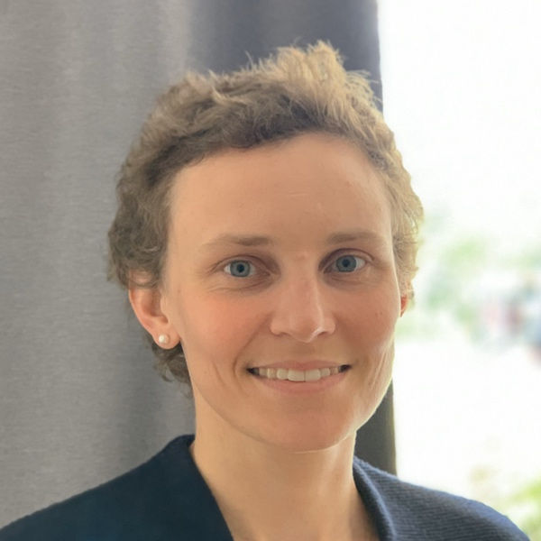

# Elena Sokolova 
[elena@sokolova.dk](mailto:elena@sokolova.dk) 

I have graduate-level degrees in translation, linguistics and second language pedagogy. 
I have been teaching Danish for ten years (online in Zoom, blended courses, regular classroom groups and one-to-one), including levels B2 & C1 (Prøve i Dansk 3 & Studieprøven). 

[CV (Danish)](cv.md) 

## Learn Danish online 

* [One-to-one lessons in Zoom](private-danish-language-lessons-online-in-zoom)

* [Levels & duration for online group classes](online-group-classes-levels-and-schedule)

* Sign up for group courses
  
  * [Forberedelse til Prøve i Dansk 2](forberedelse-proeve-i-dansk-2)
<a class="btn" href="https://elenasokolova.podia.com/online-forberedelse-til-prove-i-dansk-2/buy"> Tilmeld dig kurset</a>

  * [Forberedelse til Prøve i Dansk 3 (Mundtlig + Skriftlig)](online-forberedelse-til-prøve-i-dansk-3-2021)
<a class="btn" href="https://elenasokolova.podia.com/online-forberedelse-til-prove-i-dansk-3-mundtlig-skriftlig/buy"> Tilmeld dig kurset</a>

  * [Forberedelse til Skriftlig fremstilling i Prøve i Dansk 3](online-forberedelse-til-proeve-i-dansk-3-skriftlig)
<a class="btn" href="https://elenasokolova.podia.com/forberedelse-til-skriftlig-fremstilling-i-prove-i-dansk-3/buy"> Tilmeld dig kurset</a>

## Blog  

* [How far would you ride on a bike without a frame?](how-far-would-you-ride-on-a-bike-without-a-frame)

* [The ultimate neuro-linguistic technique for fluency in Danish](the-ultimate-neuro-linguistic-technique-for-fluency-in-Danish)

* [How to start the essay task at the Studieprøven exam](how-to-start-the-essay-task-at-the-studieproeven-exam)
 
* [Grammar and vocabulary tips for describing data in the essay at Studieprøven](grammar-and-vocabulary-tips-for-describing-data-in-the-essay-at-studieprøven)
 
* [Small words – big difference: make your Danish sound more native-like](small-words-big-difference-make-your-danish-sound-more-native-like)
 
* [Så - is not just a function word: learn how the word order may change the meaning](saa-is-not-just-a-function-word.md)
 
* [Describing percentage in Danish](describing-percentage-in-danish.md)
 
* [Grammar and vocabulary tips for writing an email at Prøve i Dansk 3 (Delprøve 1)](grammar-and-vocabulary-tips-for-writing-a-mail-proeve-i-dansk-3-delprøve-1.md)

## About me

My name is Elena Sokolova. I moved to Denmark in 2010 to do my Master's in Linguistics at Aarhus University. Before, I lived in Moscow, where I majored in translation and interpreting. I have always been interested in bilingualism, so I have chosen a bilingual track in my life. To learn a new language, you need to build a language personality over time, and then you'll start feeling this language. But nothing comes from nothing, so personal efforts and essential guidance and scaffold should support you in learning a new language. I believe that adults can master a foreign language and become near-native users of this language through conscious learning, living into the language, and using it actively. 

## Video tutorials on youtube

* [Danish consonants and diphthongs](https://youtu.be/eD3BYwY6jDE)
* [Danish vowels part 1: front, unlabialized](https://youtu.be/gs1maKrlBEw)
* [Danish vowels part 2: front, labialized](https://youtu.be/IG1LCKSYbxI)
* [Danish vowels part 3: back labialized](https://youtu.be/cQX8SRfQ9Z8)
* [Gender and grammatical forms of nouns in Danish](https://www.youtube.com/watch?v=94aFjF9Z6QY)

## PDF files for video tutorials

* [Gender and grammatical forms of nouns in Danish](grammar-nouns.pdf)
* [How to make Questions](How to make Questions.pdf)

## Papers and writings
* [Narrative competence of children with migrant background](./sokolova-2010-narration-in-migrant-children.pdf)
* [Perfective and imperfective aspect in Russian and its translation into Danish](./sokolova-2011-russian-verb-aspect-in-danish.pdf)
* [Russian accent in Russian native speakers of Danish as a second and foreign language](./sokolova-2012-ma-thesis.pdf)
* [Interaktions rolle i post-task ordgenkendelse hos begyndere](sokolova-2013-interaktion-og-tasks-ordtilegnelse.pdf)
* [Kulturmøder og pædagogiske implikationer i forberedelse til Prøve i Dansk 3](./sokolova-2014-dpu-diplomopgave.pdf)

* * * 

SokolovaDK CVR-nr.: 41433876

