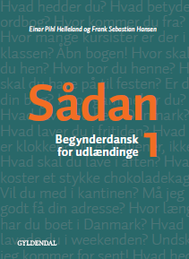

# Sing up for online group classes starting in August & September

Sign up deadline for C1 is August 17th.

If you have questions while signing up online for the course, e.g., if you are in doubt what level to choose, do not hesitate to write me directly by mail, [elena@sokolova.dk](mailto:elena@sokolova.dk). We can always discuss your needs and preferences, it would be also helpful for me to know your previous background in studying Danish to help you choose the right level. 

Level | Duration | Schedule | Lessons | Total price | Register
-- | -- | -- | -- | -- | --
A1 (6-8 students) [Course Info](a1-danish-online) | 03.08 - 21.10 | Mon. & Wed. 9:15-11:00 | 48 | 5532 DKK | <a class="btn" href="https://elenasokolova.podia.com/a1-danish-online">Enroll & pay</a>
A2 (6-8 students) [Course Info](a2-danish-online) | 04.08 - 08.10 | Tue. & Thu. 17:30-19:15 | 40 | 4360 DKK | <a class="btn" href="https://elenasokolova.podia.com/a2-danish-online">Enroll & pay</a>
B1.1 (8-10 students) [Course Info](b1-danish-online) | 07.08 - 09.10 | Fri. 9:00-12:30 | 40 | 4360 DKK | <a class="btn" href="https://elenasokolova.podia.com/b1-1-danish-online">Enroll & pay</a>
C1 Saturday Studieprøven Prep Course (8-10 students) [Course Info](studieprove-online-course) | 5.09 - 14.11 | Sat. 9:00-12:30 | 44 | 4796 DKK | <a class="btn" href="https://elenasokolova.podia.com/c1-online-studieproven-saturday-prep-course">Enroll & pay</a>
C1 Monday Studieprøven Prep Course (8-10 students) [Course Info](studieprove-online-course) | 24.08 - 2.11 | Mon. 17:00-20:30 | 44 | 4796 DKK | <a class="btn" href="https://elenasokolova.podia.com/c1-online-studieproven-prep-course">Enroll & pay</a>

## You need to order and buy the study book on your own before the course start. See the links below to order the book for your level. The course price does not include the book.

* Level A1 <a class="btn" href="https://gyldendal-uddannelse.dk/products/sadan-1-bog-35032-9788702144260?gclid=Cj0KCQjw9IX4BRCcARIsAOD2OB2ORKliBuOlNZSx9lSi3LTTOLF6rPKOiEX8ZeZP80hL9_r6EOKI3LkaAt_JEALw_wcB&gclsrc=aw.ds">Buy *Sådan 1*</a>

  
* Level A2 <a class="btn" href="https://gyldendal-uddannelse.dk/products/sadan-2-bog-35033-9788702144277">Buy *Sådan 2*</a>

 
* Level B1.1 & B1.2  <a class="btn" href="https://gyldendal-uddannelse.dk/products/sa-kan-du-lare-det-bog-40351-9788702185676">Buy *Så kan du lære det*</a>

