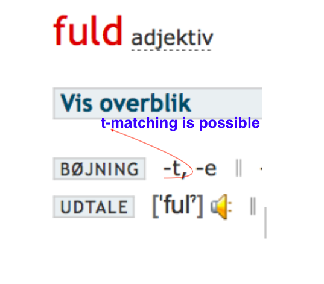
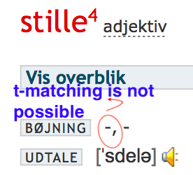

# Danish adjectives Part 1 

In this blog post you will learn about how to use Danish adjectives in front of the noun in the singular indefinite (like a big apple).

## Grammatial gender matcning 

Danish adjectives usually match the grammatical gender of the noun in the singular indefinite, which they describe. There is no such a phenomenon in English. En vej (=a way) is of ‘en’ (common) grammatical gender, et bord (=a table/desk) is of ‘et’ grammatical gender. So the same adjective ‘lang’ (=long) as the majority of the Danish adjectives will take a -t ending to describe an ‘et’-gender noun, like et bord. In other words, Danish adjectives behave differently witn ‘en’, and ‘et’ gender nouns in singular indefinite. 

It will look like that: 

*en lang vej* = a long way 
*et langt bord* = a long table/desk

## When t-mathcing is not possible?

Adding ‘-t’ to the adjective is a techinal matching and should be rememberred as a rule. 
The -t matching of adjcetives happens only when the noun is in the singular form. Often, this t-matching is called t-form of the adjective. 

As mentioned above, the t-matching happens usually or in the majority of cases, but not always, because not all the adjectives are technically able to make a t-form due to their initial form and phonetic regularities in the language. 

See the example for the adjective *flot* (=excellent/gorgeous):
*et flot resultat* = an excellent result
*et flot præstation* = an excellent performance

The adjective *flot* will behave similar with *et resulat* and *en præstation*, even though the two nouns belong to different grammatical genders. The adjective *flot* already ends in -t in its initial form, so no matching is possible. Due to the phonetic rules in Danish the word cannot end in a double consonant letter having no vowel afterwards. So to say *et flott* resulalt*, would be logically correct according to the rule, but is wrong in language usage. However, the case is different with ‘fuld’, as it ends in two different consonants, so -t adding is possible. 

*et fuldt hus* = a full house
*et fuldt glas* = a full glass

Other cases then -t matching is not possible, is then the initial dicitonary form of the adjcetive ends 
in -e: 
*en moderne lejlighed* = a modern flat
*et moderne hus* = a modern house

*en stille landsby* = a quite village
*et stille område* = a quite area/neighbourhood;

and in -sk/-s
*en gammeldags tradition* = a old-fashioned tradition
*et gammeldags komfur* = an old-fashioned stove

*en fælles stue* = a common/shared room
*et fælles projekt* = a common projcet

## How to predict the behaviour of the adjective? 
It is not possible to remember all the adjectives and all their perularities. 
A reliable tip is to learn the noun with its gender, so you will automatically make the right choice of the adjective form with a singular indefintie noun. Learn the noun gender goup - '*et*' or '*en*' and it will pay you off in the correct usage of adjectives. 
Another way is to check out in the dictionary - especially adjectives, which may have not have -t matching. 

