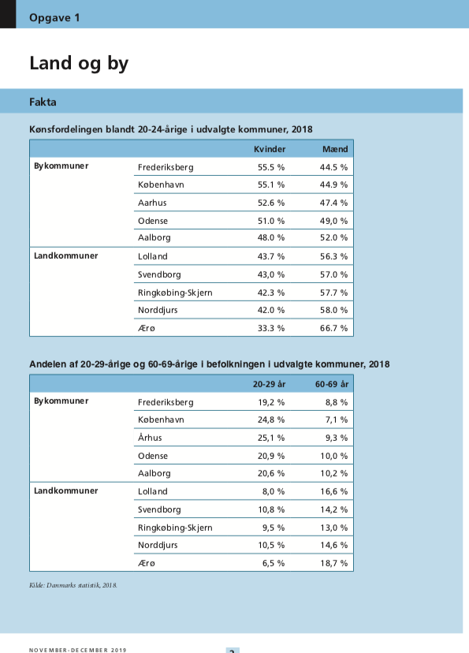
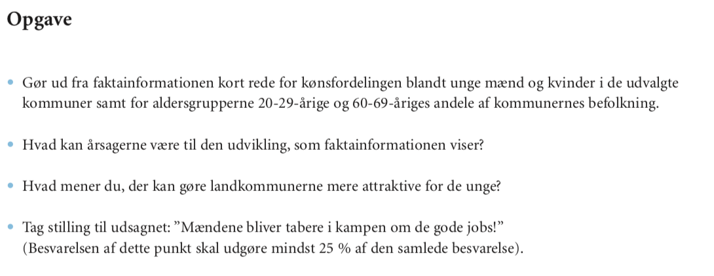

# The first 30 minutes of the Writing task in Studieprøven

In this blog post, you will learn about the rule of the first 30 minutes for the Writing task (Skriftlig fremstilling) in the written part of the Studieprøven exam. This rule will help you to complete the Writing task in the rest 2,5 hours. The three hours of the Writing task fly during the exam! Proper planning and understanding of the task questions and even data titles can save time for writing a coherent text on the topic. 

## How to get started with the Writing task of the Studieprøven exam?

In this blog post, you will learn about the rule of the first 30 minutes for the Writing Task (Skriftlig fremstilling) in the written part of the Studieprøven exam. This rule will help you to complete the Writing task in the rest 2,5 hours. The three hours of the Writing task fly during the exam! Proper planning and understanding of the task questions and even data titles can save time for writing a coherent text on the topic. 

## Describing data is a compulsory part of any Writing task of the Studieprøven exam

For the Writing task (let us call it further an essay), you receive an exam set with three structurally similar tasks but given on three different topics. You can choose between the three tasks, depending on what topic seems more comfortable to write about or familiar to you. All three tasks contain a compulsory question in the assignment description:

*‘Punkt 1: Gør ud fra faktainformationen kort rede for …’*

So the task is to describe the main points in the data set usually given in a graphical representation (a table, a diagram, a figure or a pie-chart) about a specific process, a social or an economic issue, or a social trend over a period time. This data description is usually the first logical part of the first ‘real’ paragraph of the essay after an optional short introduction (Introduction is not compulsory and is not on the list of the assessment criteria). You can find an example of the previous year’s exam set here: Studieprøven, November-December 2019. https://uim.dk/arbejdsomrader/danskundervisning-og-prover-for-udlaendinge/prover/danskprover/eksempler-pa-tidligere-afholdte-prover

## Why describing data is the most predictable part of the Writing task?

I noticed from my teaching practice that describing data in general and statistical data, in particular, often creates obstacles the first time you try to write a trial exam essay. Some students even think it’s the most challenging part of the Writing Task. However, it is the part of the written exam to which you can be best prepared, regardless of which topic the exam will have. Moreover, you can learn the most useful terms, preposition phrases before the exam, and have them ready in your head on the big day! 

If you face difficulties in getting ideas about what to write on the chosen topic, think of the statistical data on an exam material issue as a source for ideas. Data description will help you organize your thoughts in the following paragraphs, where you, for instance, should write about the reasons and consequences of the given issue development over some time. 

## How much to write?

Since the whole written assignment should be a minimum of 400 words, the data description part of the essay should be around 80-100 words and not more. Considering this length, you only need to choose the main points from the data information. 

## The rule of the first 15 minutes

To write a coherent essay, you need to understand the context of the Writing task in whole and how the data set correlates with the title of the task. In this way, the data description will not stand as a paragraph without connection to the other questions in the task. Here is the plan for the first 15 minutes of your Writing task. 

1. Read and make sure that you have understood the explanatory sentences under the data material first (e.g., a table or the diagram) before looking at the data set. They often contain food for thought and hints towards what to pick up for data description. In other words, they cast the light on the issue and give the contextual and non-statistical summary of the issue. The explanatory sentences look like this in Opgave 1 ‘Land og By’ from winter 2019 (see under the to tables): 

Explanatory sentences

*Den igangværende urbanisering har i flere år været genstand for en del debat. Man har især diskuteret det bekymrende i, at der hos den yngre del af befolkningen er en udtalt bevægelse fra landdistrikterne ind mod byerne. 
Denne udvikling har konsekvenser for befolkningens alderssammensætning i henholdsvis land og by, og da det især er de unge kvinder, der vælger at flytte til byerne, har den også konsekvenser for kønsfordelingen blandt de unge. Spørgsmålet er, hvad denne tendens vil betyde på lidt længere sigt.*

2. Make sure you have understood all the words and terms in the explanatory sentences. Look the unknown words up in the Danish-Danish dictionary with definitions, if in doubt. Try even to translate the sentences to your native language, to make sure you’ve understood them. If you can also interpret them with your own words, then you have understood them! 

3. Read the four questions in the task description before you look at the data or visually analyze them. It will already help you to look at the data set with the perspective of what you should write about in these four questions. The questions for the task can be as follows (e.g. from Opgave 1 ‘Land og By’ from winter 2019):

