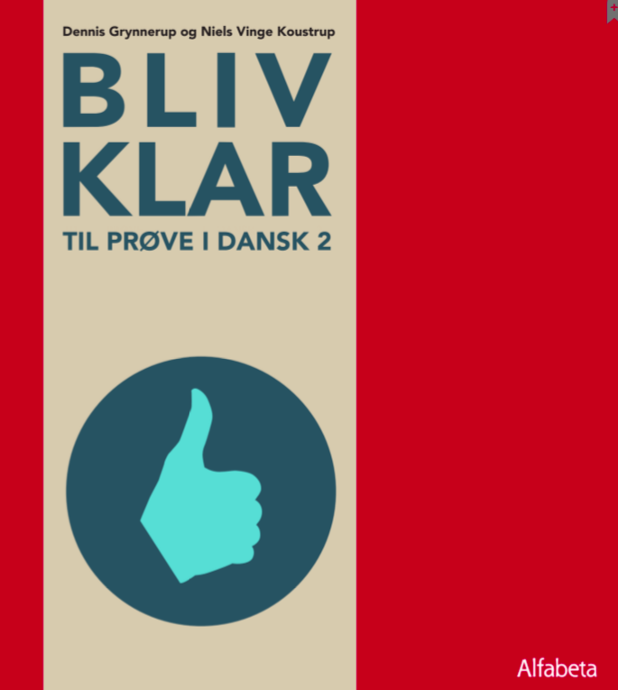

# Forberedelse Prøve i Dansk 2 
(maks. 10 deltagere på holdet online i Zoom)

## Datoer og tid
* den 22. februar - 13. maj 2021
* mandage & torsdage kl. 16:00-17:30
* 12 uger; 48 lektioner i alt

<a class="btn" href="https://elenasokolova.podia.com/online-forberedelse-til-prove-i-dansk-2/buy"> Tilmeld dig kurset</a>

## Niveauet

Kurset er på niveau B1+ på Den Fælles Europæiske Referenceramme for Sprog.
Du skal f.eks. have bestået modul 3 på DU3/'Danish for Intermediate learners' og være tilmedlt DU3 modul 4 eller have bestået DU2 modul 2.5. 

## Praktisk information  
* Der er maksimum 10 deltagere. Tilmeld dig efter først–til–mølle–princippet. 
* Efter dagens program får du tilsendt en skriftlig opgave som hjemmearbejde. Det er frivilligt at lave hjemmearbejde, men du får individuel feedback med i prisen. 

Skriv gerne en e-mail til [elena@sokolova.dk](mailto:elena@sokolova.dk), hvis du har spørgsmål. 

## Undervisningsmaterialet

Undervisningssproget er dansk, men vi bruger gerne engelsk som hjælpesprog der, hvor det er relevant.
Undervisningsmaterialet er bogen ‘Bliv klar til prøve i dansk 2’. Du skal selv anskaffe dig bogen. 
Bogen i trykt form  <a class="btn" href="https://www.alfabetaforlag.dk/bliv-klar">Køb *At skrive*</a> 
Digital bog (i-bog) med enkeltbrugerlicens (online/offline) og profiloprettelse <a class="btn" href="https://www.alfabetaforlag.dk/bliv-klar-til-proeve-i-dansk-2-i-bog">Køb i-bog *Bliv klar til prøve i dansk 2*</a>
Læreren vil også supplere undervisning med andre digitale materialer.

SokolovaDK CVR-nr.: 41433876
