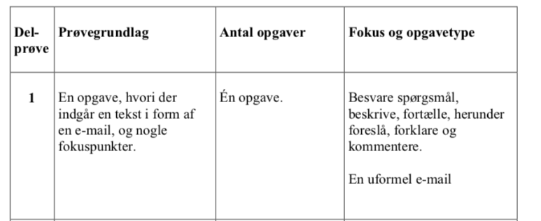
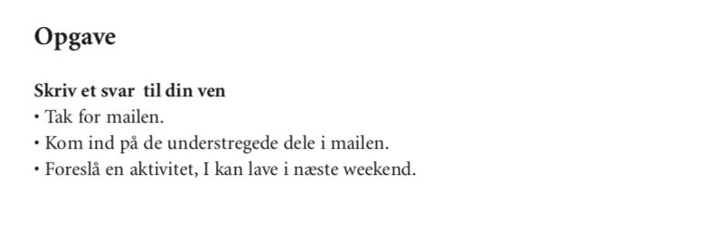

# Grammar and vocabulary tips for Writing an email Prøve i Dansk 3 (Delprøve 1)

In this blog post, you’ll learn some grammar and vocabulary tips for writing the Writing task at Prøve i Dansk 3 (Delprøve 1).

To begin with, this is a compulsory task, so it’s an excellent strategy to have some prepared and memorized structures ready for the exam. To succeed in writing the task, I advise you to understand the assessment criteria and what you are expected to write. 

Email writing is the task where your writing skills for informal writing are assessed. It does not mean, that you write as casual as on Facebook and any chat thread, but if you think of the settings, then choose a friendly, engaged in the communication tone with elements of discussing an issue related to the receiver. 

The focus of the email task is to answer the questions in the task email. That would imply such speech acts as description, narration (elements of storytelling), suggestion, explanation and giving comments. Here below is a screenshot from the guidelines for PD3. There the task is described in terms of the focus aspects in it. These focus parts make the ground for the assessment criteria, not to mention the high level of general literacy and correct language use.

Here below is the example of Delprøve 1 from May, 2020   

 

## Make sure you have understood the original task email

* Read the whole original email of the task and make sure, you have understood all the words and the situation. 
* It will be a fiasco to realize after the exam, you have misunderstood the email and wrote something irrelevant. 
* Look up new words, if needed. 
* Count how many questions there are in the task email. 
* They all are underlined. 

In the example from the exam paper given above you have to answer the following questions:  
> *Tror du, du kommer til at savne skolen?*
> *Har du nogen idéer til, hvad vi kan gøre, så Laszlo hurtigere lærer dansk?*
> *Hvad gjorde du egentlig for at få nogle danske venner?*
> *Og så glæder jeg mig til at ses næste weekend. Hvad synes du, vi skal lave?*

## Help your brain to think about one problem at a time

Write down your ideas in keywords for each question. It will help you to focus your attention on accuracy and grammar when you will start writing. In other words, your exam stressed brain will have to multitask less. It’s a known fact that when you make up the sentence and think about what to write, it seems for necessary that making a correct word order. But you will free your mind of this ‘what-to-write-about’ load if you put down key words before formulating full sentences. 

## How to write the greeting
* It’s essential to keep the focus on what you are asked about in the task email, which you are writing an answer to. 
* Anyway, any email should start with an informal greeting. 
* Never put a comma after the person you greet, unlike in English. 
* An exclamations mark may be used, but some people consider it too emotional or old-fashioned. 

E.g. 

> *Kære Lukas*
> *Tak for din e-mail. Det var godt at høre fra dig.* 

or 
> *Hej Lukas*
> *Hvor er det dejligt, at du har skrevet - tak for din sidste e-mail. Jeg håber også, alt er vel hos dig.* 
... 
> *Mange hilsner/Venlige hilsner/Kærlig hilsen/Bedste hilsner/Med venlig hilsen*
> *Lukas*

Mind the plural and singular forms of *en hilsen - hilsner*

## Tips to refer to the original mail and keep the communicative focus of your reply mail. 
A good expression to use is *med hensyn til noget* = 'as far as something is concerned'. Mind the abbreviation is *mht.*, and no comma is needed after unless you have a built-in subordinate clause:

Here below are several examples of how to refer to the original email:

> *Med hensyn til ideer til, hvad man kan gøre for at lære dansk hurtigere, synes jeg, at man tilmelde sig et internsivt kursus på en sprogskole.*
> *Mht. hvordan man kan lære dansk hurtigere, synes jeg, at det er en god ide at tilmelde sig et kursus på en sprogskole.* 

Synonyms for *med hensyn til* are *angående* = 'regarding', and *Når det kommer til …*= 'when it comes to ...'
For example:

> *Angående min danskklasse tror jeg helt bestemt, jeg vil savne mine klassekammerater, for vi er blevet gode venner alle sammen.* 
> *Når det kommer til at få danske venner, synes jeg helt bestemt, det kan hjælpe ham at tilmelde sig en fritidsaktivitet/en sportsklub. Jeg synes også, det er en god ide at deltage i forskellige sociale arrangementer på arbejde, hvor din kæreste kan have mulighed for at øve sig på dansk/at øve sit danske (sprog), når han allerede har lært noget dansk.* 

It’s also possible to use the verb to ‘ask’ in its Danish equivalents: *at spørge* and *at bede*. 
*At spørge* is used to ask about information or facts (='to interrogate') while *at bede* means to ask to do something or to give something or do a favour.*
> *Du beder mig/har bedt om at fortælle dig, hvad jeg gjorde for at lære dansk.* 
> *Du spørger om, hvordan (SV) jeg synes, (at) man kan lære dansk hurtigere. (nutid)*
> *Du spurgte (datid) mig, om jeg ville (datid) komme til at savne skolen. (datid) Det tror jeg helt sikkert, jeg vil. (nutid, hvor jeg mener fremtiden).*
> *Du spørger mig om (about), hvordan man kan tilmelde sig et danskkursus.* 
> *Du spørger mig om, hvorvidt det er en god ide at melde sig ind i en sportsklub.*

To avoid writing two times *om*, use *hvorvidt* in the subordinate clause in the meaning ‘if/whether’. 
> *Jeg spørger, om (if/whether) det er en god ide.*
> *Du spørger i din email om, hvorvidt det er en godt ide.*
> *Du beder mig/har bedt om at fortælle dig, hvad jeg gjorde for at lære dansk.* 

## Tror or synes?

You use *tro* about a prognosis, which you are not sure about because you do not have any personal experience with it or you do not know, what the factual information about it is like. Or you may not know whether the answer is true or false, and it may be based on facts and objective conditions. 

E.g. 
> *Jeg tror, jeg vil savne skolen.* => The time will show, whether I will miss the school.

You use *synes*, when you make a suggestion or propose an idea, which can be discussed. In other words, what you suggest can be discussed and other people may think differently about  and is more based on your personal/subjective view. 
> *Jeg synes, der er mange ting, (som) din kæreste kan gøre for at lære dansk hurtigere.* 
> *Jeg synes f.eks./måske/heller ikke/næsten altid, at det kan hjælpe ham at gå til nogle fritidsaktiviteter, hvor man kan bruge sproget og få venner, som har samme interesser og er modersmålstalende.*

Remember that *ikke, også, altid, aldrig, gerne, måske* come immediately after *tro/synes.* 
> *Jeg synes dog ikke, det giver mening eller er særlig nyttigt at se film eller tv-serier på dansk, hvis din kæreste er nybegynder. Jeg synes helt bestemt, at din kæreste først skal lære mere udtale, for hvis man kan udtale rigtigt, vil man også kunne forstå mere, når man lytter.> *

## Grammar tips fоr the communicative focus in the email writing

### Verbal tenses for describing or telling a story (at beskrive & at fortælle)
Imagine such a sentence in the original mail: 
> *Hvordan går det med din jobsøgning? Jeg håber, det går fremad, og det lykkedes (for) dig at finde et job.*

You will need to use present simple, past simple and present perfect.
> *Er det lykkedes dig at finde et nyt job?* = Have you succeed in finding a job  - The questions is in the present perfect. What are the options to answer?

> * Ja, det gjorde det. Jeg har endelig fået et nyt job hos Vestas.* 
Focus on the result without exact time indication => *førnutid* = present perfect. 

> * Ja, det lykkedes for mig, jeg fik heldigvis et nyt job i Vestas i sidste måned. 
You give an exact time indication, so use *datid* = past simple. 

> * Nej, det lykkedes desværre ikke for mig i sommer. Jeg søger stadig, og nu har jeg snart været arbejdsløs i tre måneder. Men der er også gode nyheder - jeg har fået svar på en af mine mange ansøgninger fra et firma, og de vil gerne se mig til en jobsamtale om tre uger … 
You tell about status as per today, so use *nutid* = present simple & *førnuti*d = present perfect.

### To complain or express you are said about smth (at klage over noget)
When you complain to an authorized institution or a shop, for instance, you need to persuade and call to action. 

###### A formal complaint: to a shop’s customers’ service. 

> *Jeg må desværre meddele, at den vare/den sovesofa, som I har sendt til mig har flere produktionsfejl. For det første er der flere pletter på betrækket. For det andet mangler der et par skruer i pakken. Derudover er der nogle ridser på det ene af benene. Jeg vil derfor gerne høre om, hvorvidt det er muligt at få sofaen byttet til en anden i samme farve/model. Jeg håber også, jeg ikke selv vil skulle betale for afhentning af varen og levering af den nye. På forhånd tak for hjælpen.*

When you complain to someone you know well or when you are telling about a bad experience, for instance replying a mail, where a person asks you, what was wrong with your holiday and why it was a bad experience. 

###### An informal complaint:
> *Jeg var meget ked af at opdage, at mit værelse på hotellet ikke svarede til de billeder, som jeg havde set på nettet. Der stod meget slidte møbler og værelset var ikke ordentligt rengjort. Du ved jo godt, at jeg altid prøver at være venlig, men denne gang måtte jeg klage og fik heldigvis et andet værelse. Men det havde desværre udsigt over for en central gade med cafeer og barer, så der var meget larm, og der spillede høj musik, så vi kunne ikke engang sove om natten. Det var selvfølgelig min skyld, at jeg ikke havde valgt et børnevenligt hotel lidt uden for byen, så det vil jeg gøre næste gang… Men maden var fantastisk på hotellet, så det gjorde vores ophold nogenlunde ok. Dog ville jeg ønske, at der også havde været en mulighed for at tilkøbe ekstra måltider på stedet.*

What verb tenses to choose?

You list the things, which you did not like in genereal in the past - use past simple (*datid*): 
> *Denne gang måtte jeg klage og fik heldigvis et andet værelse.*

You think back about what you should or should not have done in the past prior to the holiday - use past perfect (*førdatid*). 
> *Det var selvfølgelig min skyld, at jeg ikke havde valgt et børnevenligt hotel lidt uden for byen …*

## To make an offer/a suggestion or to suggest to meet/to do an activity together 
(*at foreslå* - to suggest)
You will mosty use modal verbes + infinitive: 

> *Vi skal i biografen - hvad tror du, vi skal se.* 
Mind, this sentence means, that you have already booked the tickets and want to surprise your friend. 

> *Hvad synes du, vi skal se?*

This sentence means, that you have not booked the tickets to the cinema yet, and is awaiting for your friend’s suggestion or any ideas for a movie.

> *Hvad synes du om at mødes i weekenden?* = What to you think about meeting? 

You suggest to meet. 

> *Jeg synes også, det er en god ide at mødes i weekenden.* 

> *Hvad siger du til at tage i biografen sammen/tage på en skovtur sammen?*  

> *Jeg synes helt bestemt, vi skal mødes! - You agree to meet or confirm, you also want to meet.*

> *Jeg vil så gerne mødes med dig og lære din nye kæreste at kende. Hvad med at tage hen på Cafe Blomsterberg fredag aften?*

> *Synes du ikke, vi kunne mødes, så vi kan tale mere om det?*

### To clarify or explain the reason 
In the PD3 email task, the original email may often contain a prompt to explaining things. In other words, you are checked whether you can write about the cause and consequence. 
You can use *fordi* (*+ledsætning SAV*) or *for* (remember main clause word order SVA). The following connectors to express clarification or to give a reason. The minor difference between the two conjunctions is that ‘for’ provides a clarification, while ‘fordi’ describes the cause. 

Other structures used to describe the cause
Det skyldes, at… = Der er fordi ... = It is cause by the fact, that… 
e.g. Min beslutgning om at tage et sabbatår skyldes, at jeg ikke er sikker på, hvad jeg skal læse videre på universitetet. 
Der er flere årsager til det/til denne situation. 
Der er flere årsager tit, at (+ SAV)...

