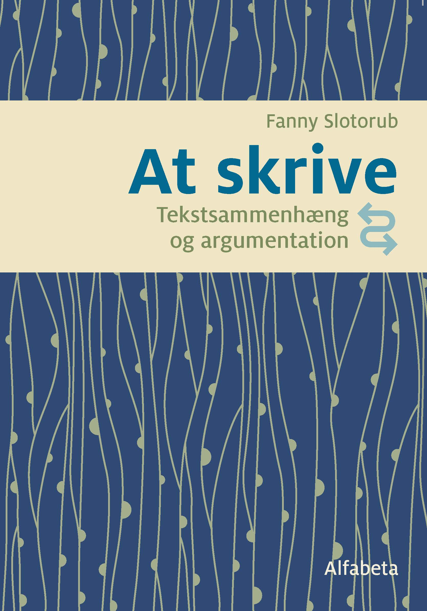

# Forberedelse til Skriftlig fremstilling i Prøve i Dansk 3 (maks. 10 deltagere på holdet online i Zoom)

## Datoer og tid
* den 16. februar - den 1. april 2021
* tirsdage & torsdage kl. 19:00-20:30
* 7 uger, 28 lektioner i alt

<a class="btn" href="https://elenasokolova.podia.com/forberedelse-til-skriftlig-fremstilling-i-prove-i-dansk-3/buy"> Tilmeld dig kurset</a>

## Niveauet

* Kurset er på niveau B2+ på Den Fælles Europæiske Referenceramme for Sprog. 
* Du skal have bestået modul 4(DU) og være færdig med modul 5 eller være tilmedlt DU3 modul 5. 

## Praktisk information  
* Der er maksimum 10 deltagere. Tilmeld dig efter først–til–mølle–princippet. 
* Efter dagens program får du tilsendt en skriftlig opgave som hjemmearbejde. Det er frivilligt at lave hjemmearbejde, men du får individuel feedback med i prisen. 

Skriv gerne en e-mail til [elena@sokolova.dk](mailto:elena@sokolova.dk), hvis du har spørgsmål. 

# Kursusprogram

## Uge 1 Forbindeord, syntaks og tekstsammenhæng 
* Introduktion til den Skriftlige fremstilling i PD3.
* Du vil lære om opgavetyper i skriftlig fremstilling og gode eksamensstrategier, samt tidsplanlægning under prøven. 
* Forbindeord & syntaks og tekstsammenhæng: du vil lære, hvad forskellen er mellem tre type forbindeord (adverbier, ledsætningskonjunktioner og hovedsætningskonjunktioner). 
* Du vil øve dig i at kategorisere forbindeord og vil øve dig i at konstruere sætninger med forbideord. 

## Uge 2  Forbindeordenes betydning 
* Du vil lære, hvad enkelte forbindeord betyder.
* Forbindeord med samme betydning: du lærer, hvordan man bruger synonymer på tværs af forskellige grupper forbindeord. 
* Du vil lære at skrive komplekse sætninger. 

## Uge 3   Quiz og øvelser til forbindeord
* Quiz og øvelser - vi arbejder med forskellige minitekster og laver indsætningsøvelser med forbindeord. 
* Alle tekster er opbygget sådan, at du også øver 2 Delprøve 2B i Læseforståelse . 

## Uge 4   Argumenterende tekst
*  Modeltekst. Vi arbejder med at analysere et eksempel på en argumenterende tekst og lærer om strukturen af en argumenterende tekst. 
*  Du får konkrete eksempler på, hvordan man kan starte alle afsnit i en argumenterende tekst. 
*  Du øver dig i at begrunde din argumentation og udtrykke holdninger. 
*  Du vil øve dig i at formulere dele af en argumenterende tekst. 

## Dag 5  Online Skriveværksted

*  Online Skriveværksted. Vi arbejder med at skrive en plan/ideer til teksten i plenum. 
*  Du vil bagefter have mulighed for at skrive en hel argumenterende tekst LIVE online og få løbende individuel hjælp og vejledning af læreren.  
*  Efter dagens undervisning får du mulighed at sende din opgave og få den rettet. 

## Uge 6  Statistiksprog
*  Statistiksprog. Du vil lære ord og udtryk, som du skal bruge i Delprøve 2A i Skriftlig fremstilling. 
*  Du lærer at forstå statistikkerne og beskrive dem. 
*  Du får konkrete eksempler på, hvordan man kan starte opgaven. 
*  Du lærer, hvordan man kan forbinde statistikken med sin argumentation, dvs. bruge faktainformation i begrundelsen. 

## Uge 7 E-mail skrivning
*  Du lærer at strukturere din e-mail kommunikativt relevant. 
*  Du lærer om forskellen på formelle og uformelle breve med konkrete sproglige eksempler.  
*  Du øver dig i at bruge verbernes tidsformer korrekt afhængigt af det kommunikative fokus og spørgsmålene i e-mailopgaven (at fortælle om fremtiden og fortiden). 
*  Du får konkrete sproglige eksempler på, hvordan man kan foreslå, kommentere, klage, vurdere, begrunde.

## Undervisningsmaterialet

Undervisningssproget er dansk, men vi bruger gerne engelsk som hjælpesprog der, hvor det er relevant.
Undervisningsmaterialet er bogen ‘At skrive’. Du skal selv anskaffe dig bogen. 
Bogen i trykt form  <a class="btn" href="https://www.alfabetaforlag.dk/skrive#">Køb *At skrive*</a> 
Digital bog (i-bog) med enkeltbrugerlicens (online/offline) og profiloprettelse <a class="btn" href="https://www.alfabetaforlag.dk/skrive-tekstsammenhaeng-og-argumentation-i-bog#">Køb i-bog *At skrive*</a>
Læreren vil også supplere undervisning med andre digitale materialer.

SokolovaDK CVR-nr.: 41433876
