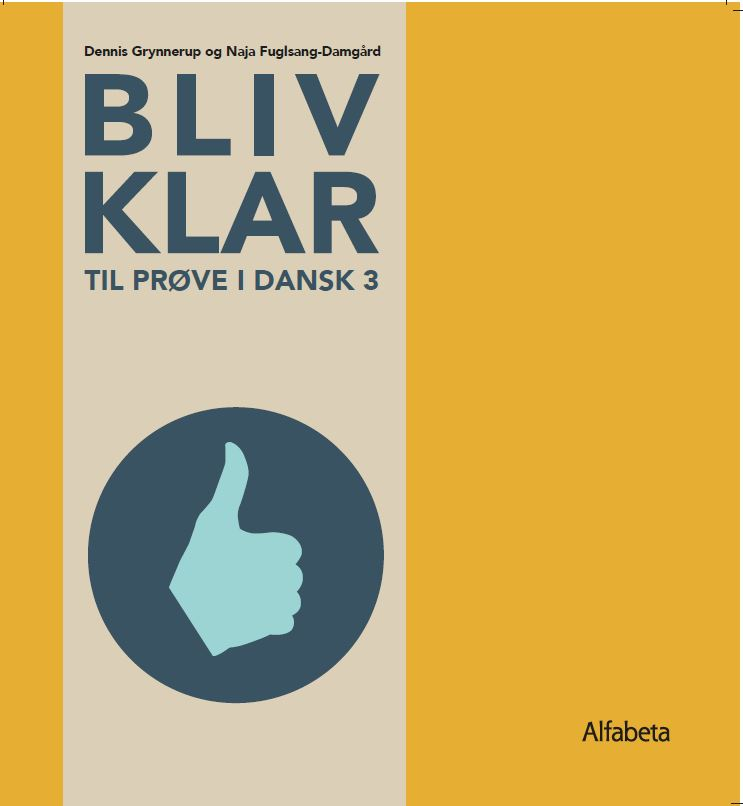

# Online Forberedelse til Prøve i Dansk 3 (Mundtlig + Skriftlig) (Aftenhold 8-10 deltagere)

## Datoer og tid 
* den 22. februar 2022 - den 28. april 2022 (påskeferie i uge 15)
* 36 lektioner 
* 4 lektioner om ugen (36 lektioner i alt)
* tirsdag & torsdag 17:00-18:30 

<a class="btn" href="https://buy.stripe.com/5kAeYih2G7sb43C7sv"> Tilmeld dig kurset & betal kr.4680
</a>

## Niveauet

Kurset er på niveau B2+ på Den Fælles Europæiske Referenceramme for Sprog.

Du skal have bestået modul 4(DU3) og være færdig med modul 5 eller være tilmeldt den sidste del af DU3 modul 5. 

## Praktiske oplysninger
* Der er maksimum 10 deltagere på holdet. 
* Tilmelding efter først–til–mølle–princippet.  
* Efter dagens undervisning får du tilsendt hjemmearbejde på e-mail. 
* Det er obligatorisk at lave hjemmearbejde, og man skal afsætte circa 6-8 timer om ugen til forberedelse hjemme.  

## Undervisningsmaterialet

Undervisningssproget er dansk.

Undervisningsmaterialet er bøger ‘At skrive’ og 'Bliv klar til Prøve i Dansk 3'. Kursusdeltagere skal selv anskaffe sig begge bøger.

Bogen ‘At skrive’  i trykt form  <a class="btn" href="https://praxis.dk/skrive#">Køb *At skrive*</a> 

Bogen 'Bliv klar til Prøve i Dansk 3' i trykt form  <a class="btn" href="https://praxis.dk/bliv-klar-til-proeve-i-dansk-3#">Køb *Bliv klar til Prøve i Dansk 3*</a> 

Skriv gerne en e-mail til [elena@sokolova.dk](mailto:elena@sokolova.dk), hvis du har spørgsmål. 

# Kursusprogram og fokusområder

* Du vil lære om opgavetyper i skriftlig fremstilling og gode eksamensstrategier, samt tidsplanlægning under prøven. 
* Forbinderord & syntaks og tekstsammenhæng: du vil lære, hvad forskellen er mellem tre type forbinderord (adverbier, ledsætningskonjunktioner og hovedsætningskonjunktioner). 
* Du vil øve dig i at kategorisere forbinderord og vil øve dig i at konstruere sætninger med forbindeord. 
* Du vil lære, hvad enkelte forbinderord betyder.
* Du vil lære at skrive komplekse sætninger.   
* Vi arbejder med at analysere eksempeler på en argumenterende tekst og lærer om strukturen af en argumenterende tekst. 
* Du øver dig i at begrunde din argumentation og udtrykke holdninger, hvilket du skal bruge i Delprøve 2B i Skriftlig fremstilling.
* Du vil øve dig i at formulere dele af en argumenterende tekst. 
* Statistiksprog. Du vil lære ord og udtryk, som du skal bruge i Delprøve 2A i Skriftlig fremstilling. 
* Du lærer, hvordan man kan forbinde statistikken med sin argumentation, dvs. bruge faktainformation i begrundelsen. 
* Du lærer at strukturere din e-mail kommunikativt relevant for Delprøve 1 i Skriftlig fremstilling.
* Du lærer om forskellen på formelle og uformelle breve med konkrete sproglige eksempler.  
* Du får konkrete sproglige eksempler på, hvordan man kan foreslå, kommentere, klage, vurdere, begrunde i både den skriftlige og den mundtlige del af prøven. 
* Du vil lære at strukturere din mundtlige præsentation og øve dig i interviewopgaven.
* Du øver dig i samtale ud fra billeder. Du lærer at beskrive situationer på billeder.  

Kursusprogrammet er opbygget omkring følgende emner : det moderne arbejdsliv, det danske arbejdsmarked, ligestilling, uddannelse, velfærdssystem & velfærdssamfund, klima (miljø og økologi, bæredygtighed), det danske sundhedsvæsen, børneopdragelse, byer & cykelkultur, det politiske system i Danmark. 

Der er ca. 5 længere skriftlige afleveringer i løbet af kurset. 

SokolovaDK CVR-nr.: 41433876
