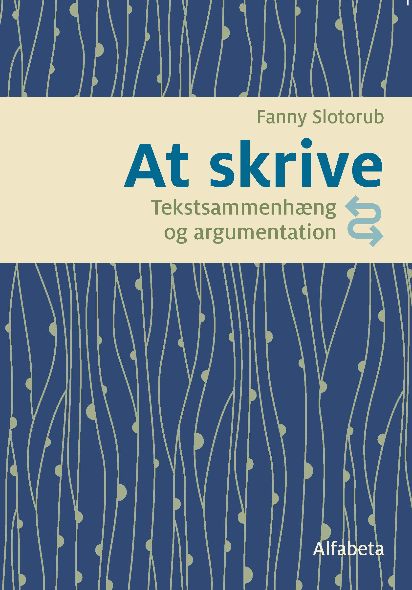

# Online Forberedelse til Skriftlig fremstilling i Prøve i Dansk 3

## Datoer og tid
* den 21. september - 9. November
* 7 online mødegange online i Zoom 
* mandage 17:00-19:00
* 2 lektioner á 45 min. med 10 minutters pause hver mødegang 
* hele kurset: 14 lektioner

### Bliv klar til den skriftlige fremstilling på 14 lektioner

<a class="btn" href="https://elenasokolova.podia.com/forberedelse-til-prove-i-dansk-3-b2-online/buy"> Tilmeld hele kurset kr.2800</a>

<a class="btn" href="https://elenasokolova.podia.com"> Tilmeld enkelte dage kr.200</a>
Tilmeld dig en enkelt dags program (se kursusprogrammet nedenfor). Prisen er kr.200. 

Skriv gerne en e-mail til [elena@sokolova.dk](mailto:elena@sokolova.dk), hvis du har spørgsmål. 

# Kursusprogram

## Dag 1 Forbindeord, syntaks og tekstsammenhæng 
<a class="btn" href="https://elenasokolova.podia.com/fdd45ce4-2e0e-4eac-b21a-9c49471ab098/buy"> Tilmelding kr.200</a>
Mandag den 21. septemeber kl. 17:00-19:00
* Introduktion til den Skriftlige fremstilling i PD3.
* Du vil lære om opgavetyper i skriftlig fremstilling og gode eksamensstrategier, samt tidsplanlægning under prøven. 
* Forbindeord & syntaks og tekstsammenhæng: du vil lære, hvad forskellen er mellem tre type forbindeord (adverbier, ledsætningskonjunktioner og hovedsætningskonjunktioner). 
* Du vil øve dig i at kategorisere forbindeord og vil øve dig i at konstruere sætninger med forbideord. 

## Dag 2  Forbindeordenes betydning 
<a class="btn" href="https://elenasokolova.podia.com/5a3c68d4-8ff6-4aab-b191-03ad1b783b1f/buy"> Tilmelding kr.200</a>
Mandag den 28. septemeber kl. 17:00-19:00    
* Du vil lære, hvad enkelte forbindeord betyder.
* Forbindeord med samme betydning: du lærer, hvordan man bruger synonymer på tværs af forskellige grupper forbindeord. 
* Du vil lære at skrive komplekse sætninger. 

## Dag 3   Quiz og øvelser til forbindeord
<a class="btn" href="https://elenasokolova.podia.com/8da85aef-e544-403b-8eb5-9d30467fd409/buy"> Tilmelding kr.200</a>
Mandag den 5. oktober kl. 17:00-19:00
*  Quiz og øvelser - vi arbejder med forskellige minitekster og laver indsætningsøvelser med forbindeord. 
* Alle tekster er opbygget sådan, at du også øver 2 Delprøve 2B i Læseforståelse . 

## Dag 4   Argumenterende tekst
<a class="btn" href="https://elenasokolova.podia.com/fe5a2497-0c04-4f86-bd69-f7c25c30ff94/buy"> Tilmelding kr.200</a>
Mandag den 19. oktober kl. 17:00-19:00
*  Modeltekst. Vi arbejder med at analysere et eksempel på en argumenterende tekst og lærer om strukturen af en argumenterende tekst. 
*  Du får konkrete eksempler på, hvordan man kan starte alle afsnit i en argumenterende tekst. 
*  Du øver dig i at begrunde din argumentation og udtrykke holdninger. 
*  Du vil øve dig i at formulere dele af en argumenterende tekst. 

## Dag 5  Onlne Skriveværksted
<a class="btn" href="https://elenasokolova.podia.com/15095b33-3179-4138-a7d4-3be0ec2ec292/buy"> Tilmelding kr.200</a>
Mandag den 26. oktober kl. 17:00-19:00
*  Onlne Skriveværksted. Vi arbejder med at skrive en plan/ideer til teksten i plenum. 
*  Du vil bagefter have mulighed for at skrive en hel argumenterende tekst LIVE online og få løbende individuel hjælp og vejledning af læreren.  
*  Efter dagens undervisning får du mulighed at sende din opgave og få den rettet. 

## Dag 6  Statistiksprog
<a class="btn" href="https://elenasokolova.podia.com/0972aeb2-796e-4571-9b2a-597739df98c4/buy"> Tilmelding kr.200</a>
Mandag den 2. november kl. 17:00-19:00
*  Statistiksprog. Du vil lære ord og udtryk, som du skal bruge i Delprøve 2A i Skriftlig fremstilling. 
*  Du lærer at forstå statistikkerne og beskrive dem. 
*  Du får konkrete eksempler på, hvordan man kan starte opgaven. 
*  Du lærer, hvordan man kan forbinde statistikken med sin argumentation, dvs. bruge faktainformation i begrundelsen. 

## Dag 7 E-mail skrivning
<a class="btn" href="https://elenasokolova.podia.com/6ddc3293-f17c-4f64-8758-a54f99076ef5/buy"> Tilmelding kr.200</a>
Mandag den 9. november kl. 17:00-19:00

*  Du lærer at strukturere din e-mail kommunikativt relevant. 
*  Du lærer om forskellen på formelle og uformelle breve med konkrete sproglige eksempler.  
*  Du øver dig i at bruge verbernes tidsformer korrekt afhængigt af det kommunikative fokus og spørgsmålene i e-mailopgaven (at fortælle om fremtiden og fortiden). 
*  Du får konkrete sproglige eksempler på, hvordan man kan foreslå, kommentere, klage, vurdere, begrunde.

## Fleksibel tilmelding 
* Der er maksimum 10 deltagere. Tilmeld dig efter først–til–mølle–princippet. 
* Du kan vælge at tilmelde dig hele kurset på én gang eller enkelt(e) dag(e). 
* Hvis du ønsker at tilmelde dig en enkelt dags program, skal du gøre det senest 3 dage før dagens program. 
* Efter dagens program får du tilsendt en skriftlig opgave som hjemmearbejde. 
* Det er frivilligt at lave hjemmearbejde, men du får individuel feedback med i prisen. 

## Undervisningsmaterialet

Undervisningssproget er dansk, men vi bruger gerne engelsk som hjælpesprog der, hvor det er relevant.
Undervisningsmaterialet er bogen ‘At skrive’. Du skal selv anskaffe dig bogen. 
Bogen i trykt form  <a class="btn" href="https://www.alfabetaforlag.dk/skrive#">Køb *At skrive*</a> 
Digital bog (i-bog) med enkeltbrugerlicens (online/offline) og profiloprettelse <a class="btn" href="https://www.alfabetaforlag.dk/skrive-tekstsammenhaeng-og-argumentation-i-bog#">Køb i-bog *At skrive*</a>

## Niveauet

Kurset er på niveau B2+ på Den Fælles Europæiske Referenceramme for Sprog. 
Du skal have bestået modul 4(DU) og være færdig med modul 5 eller være tilmedlt DU3 modul 5. 

SokolovaDK CVR-nr.: 41433876
