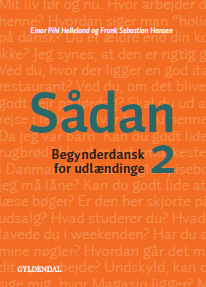

# Online group classes 

### Below you can find information about CEFR levels of the group courses I teach and their duration 

CEFR Level | Duration | Classes per week | Lessons per week (45 min.) | Homework load per week
-- | -- | -- | -- | --
A1 | 12 weeks | 2 classes | 4 | 3-4 hours
A2 | 12 weeks | 2 classes | 4 | 3-4 hours
  |   |   |   |  
B1.1 | 10 weeks | 1 class | 4 | 4 hours
B1.2 | 10 weeks | 1 class | 4 | 4 hours
  |   |   |   |  
B2.1 | 10 weeks | 1 class | 4 | 4 hours
B2.2 | 10 weeks | 1 class | 4 | 4 hours
B2.3 | 10 weeks | 1 class | 4 | 4 hours
B2.4 | 10 weeks | 1 class | 4 | 4 hours
  |   |   |   |  
C1 | 11 weeks | 1 class | 4 | 8 hours

### B2 courses can be taken in any order.

### Price per lesson (45 min.) in a group of 6-8/8-10 students is 109 DKK.

### The course price does not include the price for the study book, and you need to order a book on your own.

# Online group classes available for sign up in August-November 2020

If you have questions while signing up online for the course, e.g., if you are in doubt what level to choose, do not hesitate to write me directly by mail, [elena@sokolova.dk](mailto:elena@sokolova.dk). We can always discuss your needs and preferences, it would be also helpful for me to know your previous background in studying Danish to help you choose the writing level. 

## Sign up deadline is August 1st 

Level | Duration | Schedule | Lessons | Total price | Enroll & Pay
-- | -- | -- | -- | -- | --
[A1 (6-8 students)](a1-danish-online) | 03.08 - 21.10 | Mon. & Wed. 9:15-11:00 | 48 | 5532 DKK | <a href="https://elenasokolova.podia.com/a1-danish-online" data-podia-embed="button">A1 Danish Online</a>
[A2 (6-8 students)](a2-danish-online) | 04.08 - 08.10 | Tue. & Thu. 17:30-19:15 | 40 | 4360 DKK | <a href="https://elenasokolova.podia.com/a2-danish-online" data-podia-embed="button">A2 Danish Online</a>
[B1.1 (8-10 students)](b1-danish-online) | 07.08 - 09.10 | Fri. 9:00-12:30 | 40 | 4360 DKK | <a href="https://elenasokolova.podia.com/b1-1-danish-online" data-podia-embed="button">B1.1 Danish Online</a>
[C1 Studieprøven Prep Course (8-10 students)](studieprove-online-course) | 5.09 - 14.11 | Sat. 9:00-12:30 | 44 | 4796 DKK | <a href="https://elenasokolova.podia.com/c1-online-studieproven-saturday-prep-course" data-podia-embed="button">Studieprøven Online Sat.</a>
[C1 Studieprøven Prep Course (8-10 students)](studieprove-online-course) | 24.08 - 2.11 | Mon. 17:00-20:30 | 44 | 4796 DKK | <a href="https://elenasokolova.podia.com/c1-online-studieproven-prep-course" data-podia-embed="button">Studieprøven Online Mon.</a>

## You need to buy the study book before the course start.

## Why 12 weeks for A1 and A2 and two classes per week?
* It is crucial to have shorter but more frequent classes to have time between classes to assimilate the material. 
* You avoid being overwhelmed with new vocabulary, grammar, and pronunciation rules per class if you have two classes.
* Every class session starts with the repetition of the previous class, and the new aspects are then introduced. 
* You thrive with the same teaching style throughout the level.
* You get socialized with the same people, rather than changing a class, say every 6 weeks. 
* All my courses have а closed admission. No current enrollment practice ensures the class's homogeneity for the sake of continuity in the curriculum. 

## Why longer classes at B1, B2, C1 once per week?
* Your language becomes more advanced and elaborated. You need to concentrate less on pronunciation drilling and require more focus on having time to speak in several rounds. 
* You practice under your teacher's supervision in a group and get immediate feedback from the teacher. 
* You need time to go through a more extended explanation or a repetition round each class. 
* It is one of the best time options for busy professionals and motivated students.
* Having a full-time job, you will be happy you have scheduled one day in your weekly calendar for the Danish course.
* Six days between the classes will give you time to accumulate material and work at your own pace.
* A class/session of 4 academic hours per day will give you plenty of opportunities to practice the language, discuss, automate vocabulary, and get personal feedback.

## We use a study book even for a Zoom class 
Group classes use a study book. The book's price is included in the course price. I have selected the best-structured books, with a recognizable format of lessons from chapter to chapter. You can catch up or review a new lesson on your own, in case you have missed a class. Your book is your offline material for doing homework and studying. I strive to integrate and adapt the best practices and methods from my teaching experience from a usual physical class into an online course. I belive that the language input should be feasible, even if you go offline, moreover, you avoid having hundreds of photocopies. All the materials and exercises from my online sessions will be available for a download. 

All the books I have selected for my courses have a home page. There you have free access to audio & video (including transcripts), reading, and grammar exercises.

## Here is the list of the study books we use: 

* Level A1
  * *[Sådan 1](http://guga.gyldendal.dk/Sprog/dsa/saadan1.aspx)* af Frank Sebastian Hansen og Einar Helleland 
  
  
  

* Level A2
  * *[Sådan 2](http://guga.gyldendal.dk/Sprog/dsa/saadan2.aspx)* af Frank Sebastian Hansen og Einar Helleland 
  
  
 
 
* Level B1
   * Level B1.1 *[Så kan du lære det](https://laerdet.gyldendal.dk)* af Frank Sebastian Hansen og Einar Helleland (*Kapitler 1-5*)
   * Level B1.2 *[Så kan du lære det](https://laerdet.gyldendal.dk)* af Frank Sebastian Hansen og Einar Helleland (*Kapitler 6-10*)
   
   

* Level B2.1 & B2.2
   * Level B2.1 *[Pæredansk](https://paeredansk.gyldendal.dk)* af Birte Langgaard (*Kapitler 1-3*)
   * Level B2.2 *[Pæredansk](https://paeredansk.gyldendal.dk)* af Birte Langgaard (*Kapitler 4-5*)
   
   
  
 * Level B2.3 & B2.4
   * *[Højt til loftet](https://hoejttilloftet.gyldendal.dk/#)* af Birte Langgaard 
   
   

 * Level C1 - combinations of news and newspaper articles, video materials, podcasts, Studieprøven exam sets from previous years, my own study materials developed for grammar and vocabulary training on the level, based on authentic texts. 

