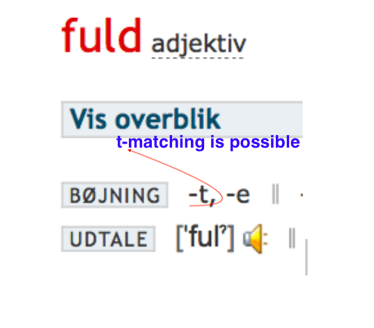

# T-matching of adjectives in Danish

*Elena Sokolova, July 24th 2021*

In this blog post, you will learn how to use Danish adjectives in front of a countable noun in the singular indefinite form (like 'a big apple').

## Grammatical gender matching 

Danish adjectives usually match the grammatical gender of the noun in the singular indefinite, which they describe. There is no such phenomenon in English. *En vej* (a way) is of *'en'* grammatical gender, *et bord* (a table/desk) is of *'et'* grammatical gender (you can learn more about it at [Gender and grammatical forms of nouns in Danish](https://www.youtube.com/watch?v=94aFjF9Z6QY). So the same adjective 'lang' (long) as the majority of the Danish adjectives will take a t-ending to describe an 'et’-gender noun, like *et bord*. In other words, Danish adjectives behave differently with 'en' and 'et' gender nouns in singular indefinite. When an adjective describes a singular indefininte noun of  *'en'* grammatical gender, nothing happens to this adjective, and it is used in its initial dictionary form, also known as 'n-form'.

It will look like that: 

> *en lang vej* = a long way  
> *et langt bord* = a long table/desk

## When t-matching is not possible?

Adding '-t' to the adjective is a technical matching and should be remembered as a rule. 
The -t matching of adjectives happens when the noun is in the singular form. Often, this t-matching is called the t-form of the adjective. 

As mentioned above, t-matching happens in most cases, but not always, because not all the adjectives are technically able to make the t-matching due to their initial form and phonetic regularities in the language. 

See the example for the adjective *flot* (=excellent/gorgeous):
> *et flot resultat* = an excellent result  
> *en flot præstation* = an excellent performance

The adjective *flot* will behave similarly with *et resultat* and *en præstation*, even though the two nouns belong to different grammatical genders. The adjective *flot* already ends in -t in its initial form, so no t-matching is possible. Due to Danish phonetic rules, the word cannot end in a double consonant letter having no vowel afterwards. So to say *et flott* resultat*, would be logically correct according to the rule but is wrong in language usage. However, the case is different with 'fuld', as it ends in two different consonants, so t-adding is possible. 

> *et fuldt hus* = a full house  
> *et fuldt glas* = a full glass

Other cases when t-matching is not possible, is when the initial dictionary form of the adjective ends in -e: 
> *en moderne lejlighed* = a modern flat  
> *et moderne hus* = a modern house;

> *en stille landsby* = a quite village  
> *et stille område* = a quite area/neighbourhood

and in -sk/-s
> *en gammeldags tradition* = a old-fashioned tradition  
> *et gammeldags komfur* = an old-fashioned stove

> *en fælles stue* = a common/shared room  
> *et fælles projekt* = a common projcet

## How to predict the behaviour of the adjective? 
It is not possible to remember all the adjectives and all their peculiarities. 
A reliable tip is to learn the noun with its gender, so you will automatically choose the adjective form with a singular indefinite noun. Learn the noun gender group - '*et*' or '*en*', and it will pay you off in the correct usage of adjectives. 
Another way is to check out in the dictionary - especially adjectives, which may not have -t matching. 

Do you have questions, comments or suggestions - email to [elena@sokolova.dk](mailto:elena@sokolova.dk). 

